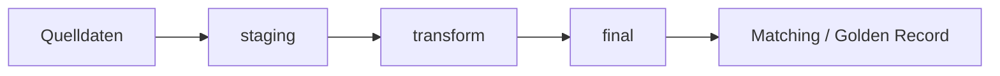

# DPI-SoSe26-Brainicles – VetKliniken-Verbund

## Projektbeschreibung

Dieses Projekt implementiert eine ETL-Pipeline zur Integration heterogener Datenquellen mehrerer Tierarztpraxen in eine gemeinsame Verbund-Datenbank.

Im Fokus stehen:

* Datenprofiling
* Datenharmonisierung
* Dublettenerkennung
* Golden Records
* Datenintegration mit DuckDB und Python

Die Quelldaten stammen aus verschiedenen Praxissystemen und liegen in unterschiedlichen Formaten vor:

* CSV
* JSON
* XML mit Namespace

---

# Team

* Alexandra Witzsche-Grafen
* Ronja Charlot Bothe
* Trieu-Vi Dao

---

# Projektstruktur

```text
docs/
└── w7_profiling/
    ├── juck_kunden.md
    ├── juck_behandlungen.md
    ├── wald_kunden.md
    ├── wald_behandlungen.md
    ├── schm_kunden.md
    ├── schm_behandlungen.md
    ├── berg_patienten.md
    ├── berg_behandlungen.md
    ├── data_dictionary.md
    └── fehlerliste.md

src/
    -> Python- und SQL-Skripte

data/
    -> lokale Datenablage

requirements.txt
README.md
```

---

# Setup

## Repository klonen

```bash
git clone <repo-url>
```

## Virtuelle Umgebung erstellen

```bash
python3 -m venv .venv
source .venv/bin/activate
```

## Dependencies installieren

```bash
pip install -r requirements.txt
```

---

# DuckDB starten

## DuckDB Web UI

```bash
duckdb -ui
```

Die DuckDB-Oberfläche öffnet sich anschließend im Browser unter:

```text
http://localhost:4213
```

---

# Datenquellen

Die Quelldaten bestehen aus mehreren heterogenen Datenquellen verschiedener Tierarztpraxen.

## Enthaltene Formate

* CSV-Dateien mit unterschiedlichen Trennzeichen (`;`, `,`, `|`)
* JSON-Dateien mit verschachtelter Struktur
* XML-Dateien mit Namespace und Nested Elements

## Wichtige Unterschiede zwischen den Quellen

* unterschiedliche Datumsformate
* unterschiedliche Telefonnummernformate
* deutsche und englische Feldnamen
* unterschiedliche Schreibweisen von Diagnosen und Tierarten
* fehlende Werte
* unterschiedliche Referenzierungslogiken

---

# Pipeline-Architektur



---

# Schichtenmodell

## staging

Rohdaten aus den Quellen ohne fachliche Transformation.

## transform

Normalisierte und harmonisierte Daten:

* Datumsformate
* Telefonnummern
* Tierarten
* Beträge

## final

Konsolidiertes Zielmodell mit Dublettenerkennung und Golden Records.

---

# Aktueller Stand

## W07 – Profiling

Abgeschlossen:

* Datenprofiling aller relevanten Quellen
* Erstellung von Profiling-Reports
* Erstellung einer Fehlerliste
* Erstellung eines Data Dictionary

Identifizierte Hauptprobleme:

* uneinheitliche Datumsformate
* unterschiedliche Telefonnummernformate
* fehlende Werte
* verschachtelte JSON- und XML-Strukturen
* semantische Inkonsistenzen
* fehlende eindeutige Referenzen
* unterschiedliche Sprach- und Formatkonventionen

---

# Verwendete Technologien

* Python
* DuckDB
* pandas
* Git/GitHub
* Markdown
* SQL


