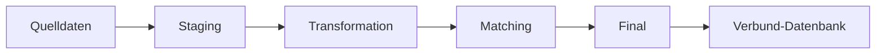

# DPI-SoSe26-Brainicles – VetKliniken-Verbund

## Projektbeschreibung

Dieses Projekt implementiert eine ETL-Pipeline zur Integration heterogener Datenquellen mehrerer Tierarztpraxen in eine gemeinsame Verbund-Datenbank.

Ziel ist die schrittweise Überführung unterschiedlicher Quelldaten in ein harmonisiertes Zielmodell, das eine einheitliche Sicht auf Kunden, Tiere und Behandlungen ermöglicht.

Im Fokus stehen:

* Datenprofiling
* Datenqualitätsanalyse
* Datenharmonisierung
* Dublettenerkennung (Entity Resolution)
* Aufbau von Golden Records
* Datenintegration mit DuckDB und Python

Die Quelldaten stammen aus mehreren Praxissystemen und liegen in unterschiedlichen Formaten vor:

* CSV
* JSON
* XML mit Namespace

---

## Team

* Alexandra Witzsche-Grafen
* Ronja Charlot Bothe
* Trieu-Vi Dao

---

## Projektstruktur

```text
docs/
├── w7_profiling/
│   ├── data_dictionary.md
│   ├── fehlerliste.md
│   ├── juck_kunden.md
│   ├── juck_behandlungen.md
│   ├── wald_kunden.md
│   ├── wald_behandlungen.md
│   ├── schm_kunden.md
│   ├── schm_behandlungen.md
│   ├── berg_patienten.md
│   └── berg_behandlungen.md
│
├── w8_staging/
│   └── zeilenstatistik.md
│
└── w9_transformation/
    └── zwischenbericht.md

src/
├── W7/
│   └── profile_juck.py
│
├── W8/
│   ├── Bergblick/
│   ├── Juckstadt/
│   ├── Schmidt/
│   └── Waldrand/
│
├── W9/
│   ├── 03_union_norm_kunde.sql
│   ├── 04_union_norm_behandlung.sql
│   ├── 05_load_gold_cluster.sql
│   ├── 06_norm_kunde_with_gold.sql
│   ├── 07_match_candidates.sql
│   ├── 08_matching_score.sql
│   └── 08_matching_score_similarity.sql
│
└── W10/
    ├── 01_create_table_final_matches.sql
    ├── 02_create_final.kunde_mapping.sql
    ├── 03_create_final.verbund_kunde.sql
    └── 04_create_final.verbund_behandlung.sql

data/
└── duckDB/
    └── dpi.duckdb

requirements.txt
README.md
```

---

## Setup

### Repository klonen

```bash
git clone <repo-url>
```

### Virtuelle Umgebung erstellen

```bash
python3 -m venv .venv
source .venv/bin/activate
```

### Abhängigkeiten installieren

```bash
pip install -r requirements.txt
```

---

## DuckDB verwenden

### Datenbank öffnen

```bash
duckdb data/duckDB/dpi.duckdb
```

### Vorhandene Tabellen anzeigen

```sql
SELECT table_schema, table_name
FROM information_schema.tables
ORDER BY table_schema, table_name;
```

---

## Datenquellen

Die Fallstudie umfasst vier Tierarztpraxen mit unterschiedlichen Datenformaten und Datenmodellen:

* Juckstadt
* Waldrand
* Schmidt
* Bergblick

### Herausforderungen

* unterschiedliche Datumsformate
* unterschiedliche Telefonnummernformate
* verschiedene Feldbezeichnungen
* deutsche und englische Attributnamen
* fehlende Werte
* unterschiedliche Referenzierungslogiken
* verschiedene Schreibweisen von Tierarten und Diagnosen

---

## Pipeline-Architektur



---

## Schichtenmodell

### Staging (Bronze)

Die Staging-Schicht enthält die Rohdaten der Quellsysteme ohne fachliche Transformation.

Tabellen:

* `staging.juck_kunden`
* `staging.juck_behandlungen`
* `staging.wald_kunden`
* `staging.wald_behandlungen`
* `staging.schm_kunden`
* `staging.schm_behandlungen`
* `staging.berg_patienten`
* `staging.berg_behandlungen`

---

### Transform (Silver)

In der Transformationsschicht werden die Daten harmonisiert und in ein gemeinsames Zielschema überführt.

Umgesetzte Normalisierungen:

* Datumsformate → ISO-Format (`YYYY-MM-DD`)
* Telefonnummern → numerische Standardform
* Tierarten → vereinheitlichte Bezeichnungen
* Beträge → numerische Datentypen
* Vor- und Nachnamen → getrennte Attribute
* Vereinheitlichung von Feldnamen und Datentypen

Zentrale Tabellen:

* `transform.norm_kunde`
* `transform.norm_behandlung`
* `transform.gold_cluster`
* `transform.norm_kunde_with_gold`

Aktueller Umfang:

| Tabelle         | Datensätze |
| --------------- | ---------: |
| norm_kunde      |        916 |
| norm_behandlung |        600 |

---

### Matching

Für die Dublettenerkennung wurde ein deterministischer, regelbasierter Ansatz implementiert.

#### Blocking

Zur Reduktion der Anzahl möglicher Vergleiche werden zunächst Kandidatenpaare gebildet.

Verwendete Blocking-Kriterien:

* gleiche Postleitzahl
* gleicher Anfangsbuchstabe des Nachnamens

Dadurch wurde die Anzahl potenzieller Vergleiche deutlich reduziert.

Kandidatenpaare:

* 1.789

#### Ähnlichkeitsmerkmale

Für jedes Kandidatenpaar werden folgende Merkmale berücksichtigt:

* E-Mail-Adresse
* normalisierte Telefonnummer
* Levenshtein-Ähnlichkeit des Nachnamens
* Levenshtein-Ähnlichkeit der Adresse

#### Matching-Tabellen

* `transform.match_candidates`
* `transform.match_scored_similarity`

---

### Final (Gold)

Die Final-Schicht bildet das Zielmodell der ETL-Pipeline. Auf Grundlage der Matching-Ergebnisse werden Dubletten konsolidiert und für jede reale Person ein eindeutiger Golden Record erzeugt. Anschließend werden sämtliche Behandlungsdaten den konsolidierten Kunden zugeordnet.

### Umgesetzte Schritte

* Übernahme aller bestätigten Matches
* Bildung zusammengehöriger Dublettengruppen
* Vergabe neuer Verbund-Kunden-IDs
* Erstellung konsolidierter Golden Records
* Zuordnung aller Behandlungen zu den Golden Records

### Erzeugte Tabellen

* `final.matches`
* `final.kunde_mapping`
* `final.verbund_kunde`
* `final.verbund_behandlung`

### Ergebnis

| Tabelle | Datensätze |
|----------|-----------:|
| final.matches | 97 |
| final.verbund_kunde | 799 |
| final.verbund_behandlung | 600 |

Die Golden Records enthalten zusätzlich Informationen über die zusammengeführten Quelldatensätze und bilden die Grundlage für verbundweite Auswertungen.

---

## Aktueller Projektstand

### W07 – Profiling

Abgeschlossen:

* Datenprofiling aller Quellen
* Erstellung von Profiling-Reports
* Erstellung eines Data Dictionary
* Erstellung einer Fehlerliste

### W08 – Extract & Staging

Abgeschlossen:

* Aufbau der DuckDB-Datenbank
* Einrichtung der Schemas
* Extraktion der Quelldaten
* Befüllung der Staging-Tabellen
* Dokumentation der Zeilenstatistik

### W09 – Transformation & Matching

Abgeschlossen:

* Aufbau der Transformationsschicht
* Harmonisierung aller Kundendaten
* Harmonisierung aller Behandlungsdaten
* Einbindung des Goldstandards
* Implementierung eines regelbasierten Matchings
* Blocking zur Kandidatenreduktion
* Evaluation der Matching-Güte

### Matching-Ergebnisse

| Kennzahl        |   Wert |
| --------------- | -----: |
| True Positives  |     96 |
| False Positives |      1 |
| False Negatives |     40 |
| Precision       | 0.9897 |
| Recall          | 0.7059 |
| F1-Score        | 0.8240 |

Die Ergebnisse zeigen eine sehr hohe Precision bei gleichzeitig guter Gesamtgüte (F1-Score).

### W10 – Vollständige Pipeline

Abgeschlossen:

* Aufbau der Final-Schicht
* Übernahme bestätigter Matching-Ergebnisse
* Erstellung eines Kunden-Mappings für alle Quelldatensätze
* Bildung konsolidierter Golden Records
* Zusammenführung redundanter Kundendatensätze
* Referenzierung aller Behandlungen auf die Golden Records
* Aufbau der finalen Verbund-Datenbank
* Fertigstellung der vollständigen ETL-Pipeline

### Endergebnis der Datenintegration

| Kennzahl | Wert |
|----------|------:|
| Ursprüngliche Kundendatensätze | 916 |
| Golden Records | 799 |
| Behandlungen | 600 |

Durch die Dublettenerkennung konnten redundante Kundendatensätze erfolgreich zu 799 eindeutigen Verbund-Kunden konsolidiert werden. Alle Behandlungen wurden anschließend den entsprechenden Golden Records zugeordnet und in das finale Zielmodell übernommen.

---
## Ausführungsreihenfolge

Die vollständige ETL-Pipeline wird in folgender Reihenfolge ausgeführt:

1. Extraktion der Quelldaten (W8)
2. Befüllung der Staging-Tabellen
3. Harmonisierung der Kunden- und Behandlungsdaten
4. Erstellung der Matching-Kandidaten
5. Berechnung der Matching-Scores
6. Erzeugung der bestätigten Matches
7. Aufbau der Final-Schicht
8. Erstellung des Kunden-Mappings
9. Erzeugung der Golden Records
10. Überführung der Behandlungen in das finale Zielmodell
---

## Verwendete Technologien

* Python
* DuckDB
* SQL
* pandas
* Git
* GitHub
* Markdown

Zusätzlich:

* Levenshtein-Distanz für String-Ähnlichkeit
* Goldstandard-basierte Evaluation mittels Precision, Recall und F1-Score
  """
